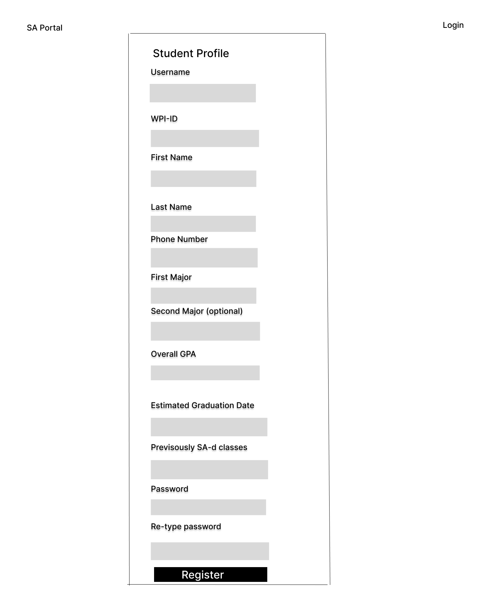

# Project Design Document

## Team Function Junction Student SA Website
--------
Prepared by:

* `Hemanth Vadlamani`,`WPI`
* `Aditya Patel`,`WPI`
* `Pierce Lindsay`,`WPI`
* `Michael Lin`,`WPI`
---

**Course** : CS 3733 - Software Engineering 

**Instructor**: Sakire Arslan Ay

---

## Table of Contents
- [1. Introduction](#1-introduction)
- [2. Software Design](#2-software-design)
    - [2.1 Database Model](#21-model)
    - [2.2 Subsystems and Interfaces](#22-subsystems-and-interfaces)
    - [2.2.1 Overview](#221-overview)
    - [2.2.2 Interfaces](#222-interfaces)
    - [2.3 User Interface Design](#23-view-and-user-interface-design)
- [3. References](#3-references)

### Document Revision History

| Name | Date | Changes | Version |
| ------ | ------ | --------- | --------- |
|Revision 1 |2024-11-15 |Initial draft | 1.0        |
|Revision 2      |2024-11-22      |Final Draft         | 2.0        |

# 1. Introduction

This document outlines the database model, user interface design, and subsystem routes for the SA management application. It provides a detailed description of the project’s structure, including user flows and functionality for both students and instructors. The system streamlines the SA recruitment process, enabling students to find and apply for SA positions while allowing instructors to efficiently manage and assign them.

# 2. Software Design

## 2.1 Database Model

<b>User</b>  
The user table holds all basic information such as username, password, and contact information. 
<b>Attributes:</b> 
Username: String (wpi email) 
Password: String 
FirstName: String 
LastName: String 
Address: String 
PhoneNum: String 
wpi_ID: int (primary key) 
Account_type: String (tells the program whether the user is a student or instructor) 
<b>Methods:</b> 
setHashPassword(String password) 
CheckPassword(String password)  

<b>Student</b> 
The student table inherits from the user table to get all basic info such as username, password, and contact information. The student table also holds the student's id, wpi_ID, GPA, major, graduation date. The role of this table is to hold information regarding a student.  
<b>Attributes:</b> 
wpi_ID: int (primary key, foreign key) 
Major: String 
Major2: String (optional second major) 
GPA: float 
Graduation date: date 
<b>Methods:</b> 
applyTo(CourseSection) (method to easily apply to a course)  
getCoursesTaken()  
getSAdCourses() 
withdrawPosition() (method to withdraw an application)  

<b>Course</b> 
The course table stores information on courses WPI offers including courseID, course number, title, and description. All the courses in the program together act as a catalog instructors can use to add courses. 
<b>Attributes:</b> 
CourseID: int (primary key) 
CourseNum: string (in the form of major and number: CS2337) 
CourseTitle: string 
CourseDescription: string  

<b>CoursesTaken</b> 
The coursesTaken table is a relationship table between student and courses that holds studentId, courseId, year, term courseTakenIDand grade. The role of this table is to track all the courses a student has taken and the courses they have SAd. 
<b>Attributes:</b> 
studentID: int (foreign, primary key) 
courseID: int (foreign, primary key)  
Grade: char 
SAd: bool (whether the student has SAd the course before)

<b>Instructor</b> 
The instructor table inherits from the user table to get all basic info such as username, password, and contract information. The instructor table also holds the instructor's id. The role of this table is to hold information regarding an instructor.  
<b>Attributes:</b> 
wpi_id: int (primary key, foreign key) 
<b>Methods:</b> 
createCourseSection(Course, term, year, sas) 
getCourses() 
getSas() (gets SAs related to an instructor through their course sections with positions with assigned applications)  

<b>CourseSection</b> 
The courseSection table holds the courseSection’s id, course's id, number, term, instructorId, and number of SA's in the course. It also holds the recommended qualification to be an SA. The role of this table to hold information regarding a specific course. 
<b>Attributes:</b> 
CourseID: int (foreign) 
InstructorID int: (foreign) 
courseSectionID(primary): int 
Term: String (in the form of A24 or B26) 
Section: int  

<b>Position</b> 
The Position table handles SA positions created for a course section. For each course section, there can be a respectful Position table that holds the SA positions minimum qualifications and the number of max positions available for students to apply for. 
<b>Attributes:</b> 
PositionID: int (primary) 
CourseSectionID: int (foreign) 
minGPA: float 
minGradeInCourse: String (A or B) 
previousSAEXP: String (instructor enters any info pertaining to SA experience requirements) 
numPositions: int (number of SA positions attached to this Position) 
<b>Methods:</b> 
AssignStudentSAPosition() (assigns a student to an open SA position slot) 
isAssignedPositionsMax() (returns true if all the SA position slots in the table are filled with assigned students) 
RejectStudentSAPosition() (rejects a student from any open SA position slots)  

<b>Application</b> 
The Application table is for handling the relationship between a student and a Position. Students interact with course sections by applying for SAships and the table holds their application status, studentID, and PositionID. 
<b>Attributes:</b> 
Application Status: String (either widthdrawn, assigned, pending, or rejected) 
StudentID: int (foreign, primary) 
CourseSectionID: int (foreign, primary)  

<b>Database UML Diagram:</b>
  <kbd>
      
  </kbd>

## 2.2 Subsystems and Interfaces

### 2.2.1 Overview

<b>Software Architecture UML Diagram:</b>
  <kbd>
      
  </kbd>

### 2.2.2 Interfaces

#### 2.2.2.1 Auth Routes

|   | Methods           | URL Path   | Description  |
|:--|:------------------|:-----------|:-------------|
|1. | login             |/login  | Logs the user into the application allowing access to different routes based on account type             |
|2. |logout             | /logout    | Logs users out             |
|3. | register_student             | /register_student   | Registered student account. based on fields specific to a student like gpa, classes taken major, etc              |
|4. | register_instructor  | /register_instructor  |Registers instructor account              |

#### 2.2.2.2 Main Routes Student

|   | Methods           | URL Path   | Description  |
|:--|:------------------|:-----------|:-------------|
|1. |studentDash              | /student/student-dashboard | Display student dashboard        |
|2. |  student_profile    | /student/student-profile| Display student profile             |
|3. |  student_edit_profile   | /student/student-edit-profile|   Edit student profile  |
|4. |  student_apply  | /student/{position id}/student-apply | Applying to SA position             |
|5. | student_withdraw | /student/{application id}/withdraw  | Withdraw a pending application             |
|6. |  recommend_position |  /student/recommend          | display position that fit with student's information             |
|7. | viewPosition | /student/view-position | View all published SA position

#### 2.2.2.3 Main Routes Instructor

|   | Methods           | URL Path   | Description  |
|:--|:------------------|:-----------|:-------------|
|1. | instructorDash             |  /instructor/instructor-dashboard   | Display instructor dashboard   |
|2. |  instructor_profile  |  /instructor/instructor-profile  | Display instructor profile  |
|3. | instructor_edit_profile     |  /instructor/instructor-edit-profile |Edit the profile |
|4. | create_course_section   | /instructor/create-course-section   |  Create a course section    |
|5. |  instructor_assignStudent   | /instructor/{application id}/assign-student  | Assign a student as SA of the course             |
|6. | create_sa_position   | /instructor/create-sa-position  |  Assign the number of SA and the requirement for the SA            |
|7. | reject | /instructor/{application id}/reject | Reject student application|
|8. | edit_SAPosition| /instructor/{position id}/edit-position | Edit existing SA position for change requirement and number of SA |
|9. |manage_application | /instructor/{course id}/manage-application |View all application for a course and decide whether assign or reject student application |

#### 2.2.2.4 Error Routes

|   | Methods           | URL Path   | Description  |
|:--|:------------------|:-----------|:-------------|
|1. |  not_found_error   | /404error           | Handles 404 error for when an expected file can’t be found             |
|2. |  internal_error | /500error   | Handles error 500 for when an unexpected internal error occurs             |                |            |              |

### 2.3 User Interface Design 

<b>index.html</b>

Purpose: Landing page where users can log in or navigate to registration page

Associated User Stories:
"As a user, I want to log in to my account with my WPI email and password."
"As a user, I want to log in to my account with my WPI Azure SSO (Single Sign-On)..."

 <kbd>
      
  </kbd>
 
 
 
 
<b>student_register1.html</b>

Purpose: Registration page for students to enter personal information, academics, and create login credentials.

Associated User Stories:
"As a student, I want to be able to create a student account and enter my profile information (username (WPI email), password, contact info (name, last name, WPI ID, phone), additional info (GPA, major, graduation date, previously SA’d courses)) so that I can have a personalized account for managing my SA applications."

 <kbd>
      
  </kbd>
 
 
 
 
<b>instructor_register.html</b>

Purpose: Registration page for instructors to create an account.

Associated User Stories:
"As an instructor, I want to be able to create an instructor account and enter my profile information (username (WPI email), password, contact info (name, last name, WPI ID, phone))."

 <kbd>
      
  </kbd>
 
 
 
 
<b>student_dashboard.html</b>

Purpose: Dashboard for students to view and manage SA applications and account information.

Associated User Stories:
“As a student, I want to view open SA opportunities…”
“As a student, I want to view a recommended SA positions list…”
“As a student, I want to check the status of my SA applications…”
“As a student, I want to withdraw my pending SA application…”
“As a student, I want to apply to one or more open SA opportunities…”

 <kbd>
      
  </kbd>
 
 
 
 
<b>instructor_dashboard.html</b>

Purpose: Dashboard for instructors to manage courses, create SA positions, and assign SAs.

Associated User Stories:
“As an instructor, I want to add new courses that I will teach.”
“As an instructor, I want to create SA positions for my courses.”
“As an instructor, I want to view all the students who have applied…”
“As an instructor, I want to view the qualifications of each student who applied…”

 <kbd>
      
  </kbd>
 
 
 
 
<b>edit_student_profile.html</b>

Purpose: Page for students to update their profile information.

Associated User Stories:
"As a student, I want to be able to create a student account and enter my profile information (username (WPI email), password, contact info (name, last name, WPI ID, phone), additional info (GPA, major, graduation date, previously SA’d courses)) so that I can have a personalized account for managing my SA applications."

<kbd>
      
  </kbd>
 
 
 
 
<b>edit_instructor_profile.html</b>

Purpose: Page for instructors to update their profile information.

Associated User Stories:
"As an instructor, I want to be able to create an instructor account and enter my profile information (username (WPI email), password, contact info (name, last name, WPI ID, phone))."
Functionality: Allows instructors to update contact information such as name, WPI ID, and phone number.

<kbd>
      
  </kbd>
 
 
 
 
<b>create_sa_position.html</b>

Purpose: Page for instructors to create SA positions for each course section.

Associated User Stories:
“As an instructor, I want to create SA positions for my courses.”

<kbd>
      
  </kbd>
 
 
 
 
<b>create.html</b>

Purpose: Page where instructors can create new courses.

Associated User Stories:
“As an instructor, I want to add new courses that I will teach.”
Functionality: Provides form fields for instructors to select course details such as title, course number, term, and section. Allows submission to add the course to the instructor’s dashboard.

<kbd>
      
  </kbd>
 
 
 
 
<b>edit_SAPosition.html</b>

Purpose: Page where instructors can edit SA Positions.

Associated User Stories:
“As an instructor, I want edit an SA Position"

<kbd>
      
  </kbd>
 
 
 
 
<b>apply.html</b>

Purpose: An overlapping section where students can apply to SA Positions.

Associated User Stories:
“As a student, I want to apply to one or more open SA opportunities by specifying a year and term I want to SA and my previous experience with the course(grade achieved and when I took the course)."

<kbd>
      
  </kbd>
 
 
 
 

# 3. References
